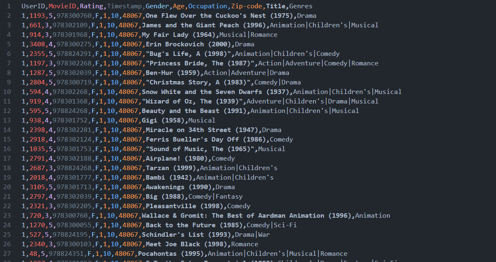

# Big-Data-Mining-HW-04

|||
|---|---|
|112598041 王衍斌|Q3, Q4, Q5|
|112598044 劉彥鴻|Q1, Q2, pre-processing|

## Result
> results of every task\
> https://ntutcc-my.sharepoint.com/:f:/g/personal/112598041_cc_ntut_edu_tw/Ek9sbYLMlnVIgZl9GLBNa-wBu2_fJ8dTlH9FyZZLPYT19Q?e=B4whle


## Usage
```bash
python3 hw4_q1.py
python3 hw4_q2.py
python3 hw4_q3.py
python3 hw4_q4.py --user <user-id>
python3 hw4_q5.py --movie <movie-id>
```

## Data Preprocessing
we joined movie id and user id to one csv file.


